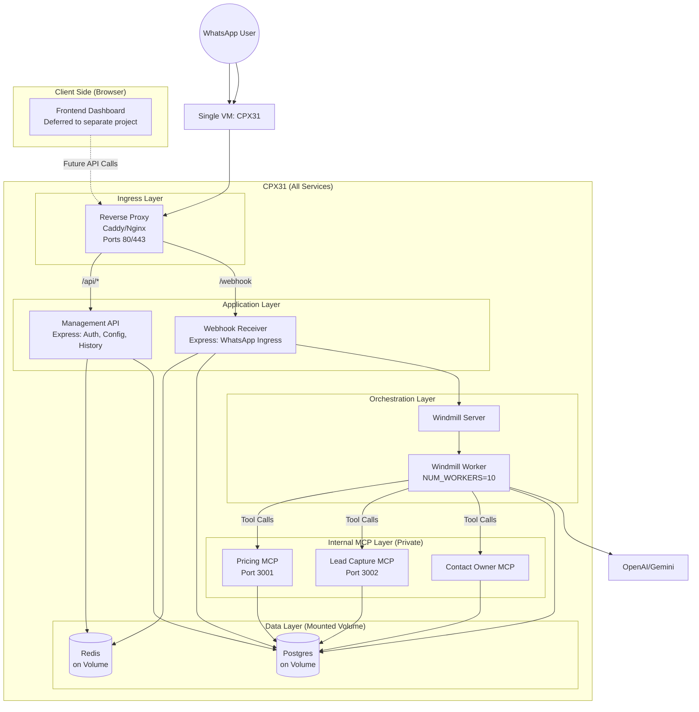
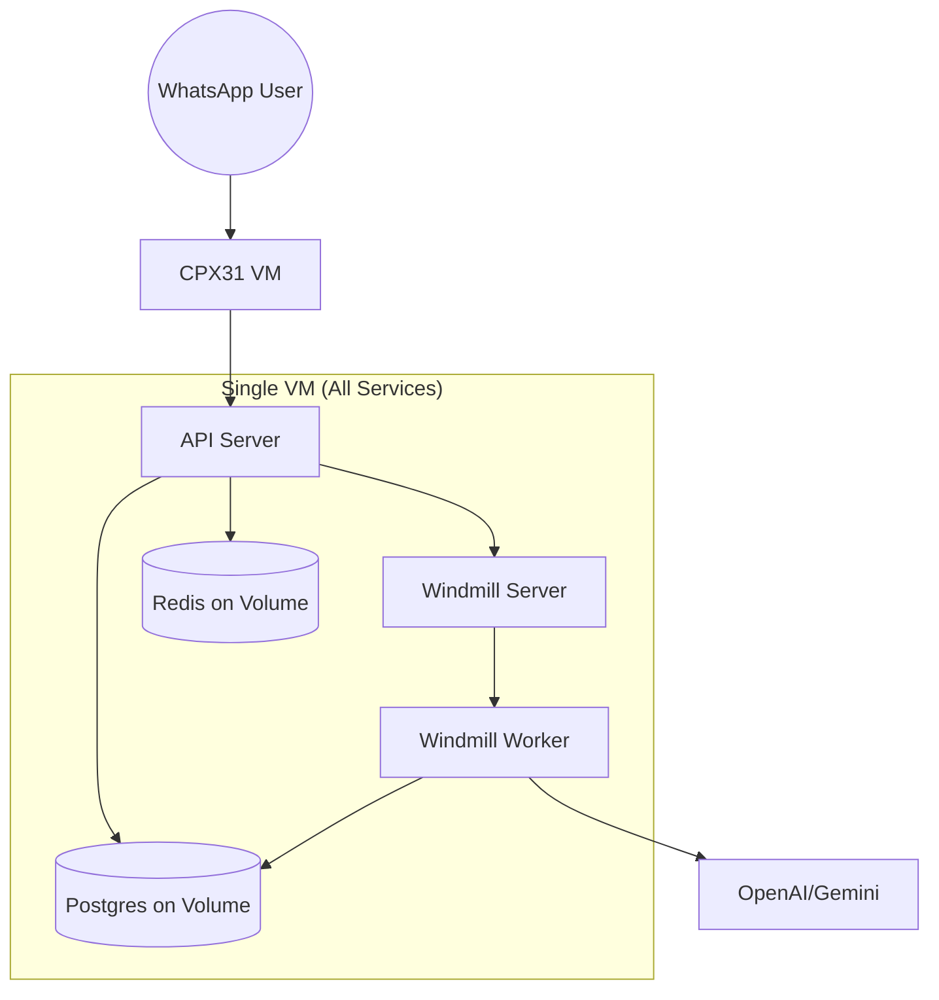
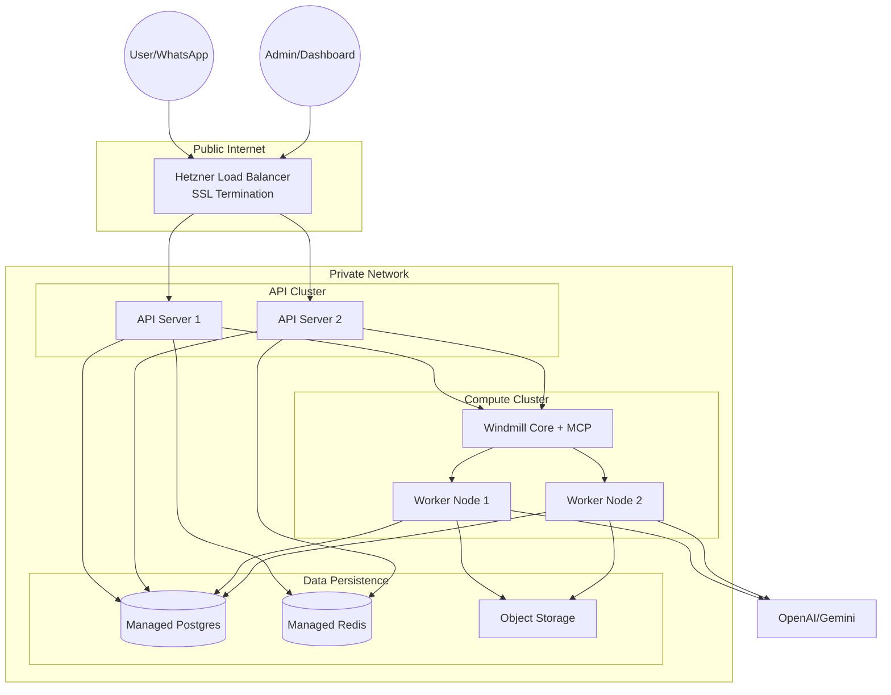

# Infrastructure Migration Plan: From Monolith to Tiered Architecture

## Executive Summary

This document outlines the migration from a single-server "box" architecture to a scalable, tiered service architecture. The plan is designed to start lean (€16/month for ~10 users) and scale cost-effectively as traffic grows.

**Key Principle**: Start minimal, measure performance, scale only when metrics indicate the need.

---

## Architecture Overview

### Core Concept: Three-Tier Architecture

1. **API Tier (Fast)**: Accepts connections, validates security, checks caches, enqueues jobs
   - **Management API**: Dashboard operations (auth, config, history) - direct Postgres queries
   - **Webhook API**: WhatsApp ingress - validates, checks idempotency, triggers Windmill
2. **Worker Tier (Slow/Heavy)**: Processes Windmill Python scripts (RAG, LLM calls) - this is what you autoscale
3. **Data Tier (State)**: The "Source of Truth" (DB, Redis, Object Storage)

**Architectural Principle**: Separate "Management Plane" (Dashboard API) from "Data Plane" (Windmill execution) for SaaS stability. Management operations use fast Express.js queries; heavy processing stays in Windmill workers.

### Data Flow

**Webhook Ingress:**
```
WhatsApp → Load Balancer → API Node (Express)
  - Verify signature
  - Check Redis rate limits
  - Idempotency check (Postgres webhook_events)
  - Trigger Windmill (async)
  - Respond 200 OK (< 3 seconds)
```

**Job Processing:**
```
Windmill Server → Queue → Worker Node
  - Step 1: Context Loading
  - Step 2: RAG + LLM (pgvector search)
  - Step 3: Reply to WhatsApp
```

---

## Phase 0: Lean MVP (Current Focus)

**Target**: 10 users, ~100 messages/minute (~1.7 req/s)  
**Cost**: ~€16/month  
**Timeline**: Immediate implementation

### Infrastructure

| Component | Specification | Cost |
|-----------|--------------|------|
| **Server** | 1x Hetzner CPX31 (4 vCPU, 8GB RAM) | €14.90/mo |
| **Storage** | 1x Hetzner Volume (10GB) | €0.60/mo |
| **Total** | | **€15.50/mo** |

**Why CPX31?**
- 4 vCPU handles ~8-10 concurrent Windmill workers
- 8GB RAM sufficient for all services
- Math: 1.7 req/s × 5s duration = 8.5 concurrent jobs (well within capacity)

### Architecture Diagram



### Implementation Checklist

#### Infrastructure Setup
- [ ] Create Hetzner Volume (10GB) named `whatsapp-data` in Hetzner panel
  - Run: `cd deployment && make volume-create`
- [x] Update `cloud-init.yaml` to mount volume at `/mnt/data`
  - [x] Add volume mount commands to `runcmd` section
  - [x] Create directories: `/mnt/data/postgres`, `/mnt/data/redis`
  - [x] Add to `/etc/fstab` for persistence
- [ ] Provision CPX31 VM using existing Makefile/scripts
  - Run: `cd deployment && make up` (then `make volume-attach`)
- [ ] Verify volume is mounted correctly after VM boot

#### Docker Compose Configuration
- [x] Create `docker-compose.prod.yml` (production-optimized)
  - [x] Remove `lsp` service (not needed in production)
  - [x] Remove `multiplayer` service (not needed in production)
  - [x] Remove `windmill_worker_native` (consolidate into standard worker)
  - [x] Configure Postgres to use volume: `/mnt/data/postgres:/var/lib/postgresql/data`
  - [x] Configure Redis to use volume: `/mnt/data/redis:/data`
  - [x] Set Postgres memory limit to 1GB (prevents OOM)
  - [x] Configure Windmill Server: `MODE=server`, `NUM_WORKERS=0`
  - [x] Configure Windmill Worker: `MODE=worker`, `NUM_WORKERS=10`, `WORKER_GROUP=default`
- [ ] Test docker-compose.prod.yml locally (if possible)
- [ ] Deploy to production VM

#### Code Changes: Idempotency Check
- [x] Update `webhook-server/app.js`:
  - [x] Inject PostgreSQL client connection (already existed)
  - [x] Add idempotency check BEFORE `triggerWindmill()` call:
    ```javascript
    try {
      const result = await db.query(
        "INSERT INTO webhook_events (whatsapp_message_id, organization_id, received_at, status) VALUES ($1, $2, NOW(), 'processing') ON CONFLICT (whatsapp_message_id) DO NOTHING RETURNING id",
        [whatsappMessageId, organizationId]
      );
      if (result.rows.length === 0) {
        // Duplicate webhook, return 200 OK immediately
        return res.status(200).json({ status: 'duplicate' });
      }
    } catch (e) {
      // Log error but continue (fail open)
      console.error('Idempotency check failed:', e);
    }
    ```
  - [x] Ensure proper error handling (fail open, don't block legitimate requests)
  - [ ] Test idempotency check with duplicate webhooks
  - [ ] Verify duplicate webhooks are rejected immediately (not queued)

#### Management API Implementation

**Note**: Frontend development is deferred to a separate team/project. This section focuses on building and testing the Management API endpoints that the frontend will consume.

**Architecture Principle**: Separate "Management Plane" (Dashboard API) from "Data Plane" (Windmill execution) for SaaS stability.

**Key Design Decisions**:
- Use Express.js for Management API (fast, direct Postgres queries)
- Do NOT use Windmill for simple data fetching (too slow for UI)
- MCP servers run on same CPX31 but are internal-only (not exposed to public)

##### API Endpoints Implementation

**Auth Domain:**
- [x] Install dependencies: `jsonwebtoken`, `bcrypt`, `express-validator`
- [x] Create `POST /api/auth/register` endpoint
  - [x] Validate email, password (min 8 chars)
  - [x] Hash password with bcrypt
  - [x] Create organization and user record
  - [x] Return JWT token
- [x] Create `POST /api/auth/login` endpoint
  - [x] Verify email/password
  - [x] Generate JWT token (expires in 24h)
  - [x] Return token + user info
- [x] Create `GET /api/auth/me` endpoint
  - [x] Verify JWT token
  - [x] Return current user + organization info
- [x] Create JWT middleware: `verifyToken(req, res, next)`
  - [x] Extract token from `Authorization: Bearer <token>` header
  - [x] Verify token signature
  - [x] Attach `req.user` and `req.organizationId` to request
  - [x] Handle expired/invalid tokens gracefully

**Tenants/Organizations Domain:**
- [x] Create `GET /api/organizations/usage` endpoint
  - [x] Require JWT authentication
  - [x] Query `usage_summary` view (from existing schema)
  - [x] Return: messages_used, messages_limit, tokens_used, tokens_limit, current_tier
  - [x] Filter by `req.organizationId` (security: users can only see their own org)
- [x] Create `PUT /api/organizations/billing` endpoint
  - [x] Require JWT authentication
  - [x] Update billing tier (Free, Pro, Enterprise)
  - [x] Validate tier exists
  - [x] Update `organizations` table

**Chatbots Domain:**
- [x] Create `GET /api/chatbots` endpoint
  - [x] Require JWT authentication
  - [x] Query `chatbots` table filtered by `organization_id`
  - [x] Return: id, name, system_prompt, temperature, created_at, status
  - [x] Support pagination (limit/offset)
- [x] Create `GET /api/chatbots/:id` endpoint
  - [x] Require JWT authentication
  - [x] Verify chatbot belongs to user's organization (security check)
  - [x] Return full chatbot details
- [x] Create `PATCH /api/chatbots/:id` endpoint
  - [x] Require JWT authentication
  - [x] Verify chatbot belongs to user's organization
  - [x] Allow updating: `system_prompt`, `temperature`, `name`
  - [x] Validate temperature range (0.0 - 2.0)
  - [x] Update database directly (don't use Windmill for config updates)
- [x] Create `POST /api/chatbots` endpoint
  - [x] Require JWT authentication
  - [x] Create new chatbot for organization
  - [x] Set default system_prompt and temperature
  - [x] Return created chatbot

**Integrations Domain:**
- [x] Create `GET /api/integrations/available` endpoint
  - [x] Require JWT authentication
  - [x] Query `org_integrations` table for available MCP tools
  - [x] Return: integration_id, name, description, enabled, config
  - [x] Filter by organization_id
- [x] Create `POST /api/integrations/enable` endpoint
  - [x] Require JWT authentication
  - [x] Enable integration for organization
  - [x] Insert/update `org_integrations` table
  - [x] Validate integration exists
- [x] Create `DELETE /api/integrations/:id` endpoint
  - [x] Require JWT authentication
  - [x] Disable integration for organization
  - [x] Soft delete or set `enabled = false`

**History Domain:**
- [x] Create `GET /api/chatbots/:id/history` endpoint
  - [x] Require JWT authentication
  - [x] Verify chatbot belongs to user's organization
  - [x] **CRITICAL**: Implement cursor-based pagination
    - [x] Use `created_at` + `id` as cursor
    - [x] Support `limit` parameter (default: 50, max: 200)
    - [x] Support `cursor` parameter for next page
    - [x] Return: `{ messages: [...], nextCursor: "..." }`
  - [x] Query `messages` table with proper indexes
  - [x] Do NOT load 10,000+ messages at once (performance killer)
  - [x] Support filtering by date range (optional)
- [x] Create `GET /api/chatbots/:id/history/:messageId` endpoint
  - [x] Require JWT authentication
  - [x] Return single message with full context
  - [x] Include related messages (thread context)

**Knowledge Base Domain (Existing - Verify):**
- [x] Verify existing endpoints work with JWT auth:
  - [x] `POST /api/chatbots/:id/knowledge/upload`
  - [x] `POST /api/chatbots/:id/knowledge/url`
  - [x] `POST /api/chatbots/:id/knowledge/crawl`
- [x] Add JWT authentication middleware to existing endpoints
- [x] Add organization_id verification (chatbot belongs to user's org)

##### Security Implementation

**JWT Configuration:**
- [x] Set JWT secret in environment variable (`JWT_SECRET`)
- [x] Configure JWT expiration (24 hours recommended)
- [ ] Implement token refresh mechanism (optional for MVP)
- [ ] Add rate limiting to auth endpoints (prevent brute force)

**CORS Configuration:**
- [x] Install `cors` middleware
- [x] Configure strict CORS policy:
  - [x] Allow only frontend domain (e.g., `https://dashboard.your-saas.com`)
  - [x] Allow credentials: true
  - [x] Set appropriate headers: `Authorization`, `Content-Type`
- [ ] Test CORS with frontend domain (even if frontend is deferred)

**Authorization Middleware:**
- [x] Create `requireOrganizationAccess(req, res, next)` middleware
  - [x] Verify user's `organization_id` matches resource's `organization_id`
  - [x] Prevent users from accessing other organizations' data
- [x] Apply to all organization-scoped endpoints
- [ ] Test authorization with different organization IDs

**Input Validation:**
- [x] Use `express-validator` for all POST/PATCH endpoints
- [x] Validate email format
- [x] Validate password strength (min 8 chars, complexity)
- [x] Sanitize user inputs (prevent SQL injection)
- [x] Validate UUIDs for resource IDs

##### MCP Server Deployment

**Docker Compose Configuration:**
- [x] Add MCP services to `docker-compose.prod.yml`:
  ```yaml
  mcp_pricing_calculator:
    build: ./mcp-servers/pricing-calculator
    environment:
      - PORT=3001
    # CRITICAL: Do NOT expose ports to host
    # Remove: ports: - "3001:3001"
    networks:
      - internal

  mcp_lead_capture:
    build: ./mcp-servers/lead-capture
    environment:
      - PORT=3002
    networks:
      - internal

  mcp_contact_owner:
    build: ./mcp-servers/contact-owner
    environment:
      - PORT=3003
    networks:
      - internal
  ```
- [x] Create `internal` Docker network for MCP services
- [x] Configure Windmill to access MCPs via container names:
  - [x] `http://mcp_pricing_calculator:3001`
  - [x] `http://mcp_lead_capture:3002`
  - [x] `http://mcp_contact_owner:3003`
- [ ] Verify MCP servers are NOT accessible from public internet
- [ ] Test MCP connectivity from Windmill workers

##### Reverse Proxy Configuration

**Caddy/Nginx Setup:**
- [x] Install Caddy or Nginx on host (or run in Docker) - Caddy in docker-compose.prod.yml
- [x] Configure reverse proxy routing:
  - [x] `/api/*` → `whatsapp_chatbot_api` container (port 4000)
  - [x] `/webhook*` → `webhook-ingress` container (port 3000)
  - [x] `/windmill*` → `windmill_server` container (port 8000)
- [x] Set up SSL certificates (Let's Encrypt via Caddy, or manual certs)
- [ ] Configure rate limiting at proxy level
- [x] Add security headers (HSTS, X-Frame-Options, etc.)
- [ ] Test routing and SSL

##### API Testing

**Unit Tests:**
- [x] Create test suite for auth endpoints (`tests/api/auth.test.js`)
  - [x] Test registration with valid/invalid data
  - [x] Test login with correct/incorrect credentials
  - [x] Test JWT token generation and verification
- [x] Create test suite for chatbot endpoints (`tests/api/chatbots.test.js`)
  - [x] Test CRUD operations
  - [x] Test authorization (user can't access other org's chatbots)
  - [x] Test pagination
- [x] Create test suite for history endpoint (`tests/api/history.test.js`)
  - [x] Test cursor-based pagination
  - [ ] Test with large datasets (10k+ messages)
  - [ ] Verify performance (< 200ms for 50 messages)

**Integration Tests:**
- [ ] Test full auth flow: register → login → access protected endpoint
- [ ] Test organization isolation: user A cannot access user B's data
- [ ] Test MCP server connectivity from Windmill
- [ ] Test reverse proxy routing

**API Documentation:**
- [ ] Document all endpoints (OpenAPI/Swagger or simple markdown)
- [ ] Include request/response examples
- [ ] Document authentication requirements
- [ ] Document error codes and messages
- [ ] Create Postman collection for testing

**Performance Testing:**
- [ ] Load test history endpoint with 10k messages
- [ ] Verify cursor pagination handles large datasets efficiently
- [ ] Test concurrent requests (10+ simultaneous users)
- [ ] Monitor database query performance (use EXPLAIN ANALYZE)

#### Database Backup Strategy
- [ ] Set up Hetzner Object Storage bucket (or Storage Box) for backups
- [x] Create backup script (`deployment/scripts/backup_db.sh`):
  - [x] pg_dump with gzip compression
  - [x] SHA256 checksums for integrity verification
  - [x] Optional S3 upload for remote storage
  - [x] Automatic cleanup of old backups (configurable retention)
  - [x] Slack notifications for success/failure
- [x] Create restore script (`deployment/scripts/restore_db.sh`):
  - [x] Checksum verification before restore
  - [x] Support for --list and --latest options
  - [x] Safety confirmation prompt
- [ ] Add cron job for nightly backups (2 AM UTC)
- [ ] Test backup restoration process
- [x] Document backup retention policy (7 days default, configurable via RETENTION_DAYS)

#### Monitoring Setup
- [ ] Install `node_exporter` on VM for Prometheus metrics
- [ ] Configure Prometheus to scrape:
  - [ ] CPU load (target: alert if Load > 3.0 consistently)
  - [ ] Memory usage
  - [ ] Windmill queue depth (most important for scaling)
  - [ ] Database connection pool usage
- [ ] Set up basic alerting:
  - [ ] CPU Load > 3.0 for 5+ minutes
  - [ ] Memory usage > 85%
  - [ ] Windmill queue depth > 20
  - [ ] Database down

#### Environment Variables & Secrets
- [ ] Audit all `.env` files for secrets
- [ ] Set up secure secret injection (via CI/CD or secret manager)
- [ ] Document required environment variables
- [ ] Remove hardcoded secrets from codebase

#### Testing & Validation
- [ ] Load test: Send 100 messages/minute for 10 minutes
- [ ] Verify response times < 10 seconds
- [ ] Verify no duplicate processing (idempotency)
- [ ] Verify data persistence after VM restart
- [ ] Verify backup restoration works
- [ ] Test all Management API endpoints (see API Testing section above)
- [ ] Verify MCP servers are accessible from Windmill but not from public internet
- [ ] Test reverse proxy routing and SSL certificates

---

## Phase 1: Production HA (Scale Trigger)

**Target**: 500-2000 users, ~500-2000 messages/minute  
**Cost**: ~€90/month  
**When to Scale**: See "Scaling Decision Tree" below

### Infrastructure

| Component | Specification | Qty | Cost |
|-----------|--------------|-----|------|
| **Load Balancer** | Hetzner LB11 | 1 | €5.90/mo |
| **API Servers** | CPX11 (2 vCPU, 2GB) | 2 | €9.00/mo |
| **Windmill Core** | CPX31 (4 vCPU, 8GB) | 1 | €14.90/mo |
| **Windmill Workers** | CPX31 (4 vCPU, 8GB) | 1 | €14.90/mo |
| **Postgres** | Managed or CPX31 | 1 | €40.00/mo |
| **Redis** | Small Instance | 1 | €5.00/mo |
| **Total** | | | **€89.70/mo** |

### Architecture Changes

- **Separate API tier**: 2x API servers behind load balancer
- **Separate compute tier**: Windmill Core (server) + dedicated Worker nodes
- **Managed database**: Migrate from self-hosted to managed Postgres
- **Managed Redis**: For shared rate limiting across API nodes

### Implementation Checklist

#### Infrastructure Migration
- [ ] Create Hetzner Load Balancer (LB11)
- [ ] Provision 2x CPX11 VMs for API tier
- [ ] Provision 1x CPX31 for Windmill Core
- [ ] Provision 1x CPX31 for Windmill Workers
- [ ] Set up Managed PostgreSQL (or dedicated DB VM)
- [ ] Set up Managed Redis (or dedicated Redis VM)
- [ ] Configure private network (10.0.0.0/16) between VMs
- [ ] Configure load balancer to route to API nodes
- [ ] Set up SSL certificates on load balancer

#### Service Separation
- [ ] Update `docker-compose.prod.yml`:
  - [ ] Split into `docker-compose.api.yml` (API nodes)
  - [ ] Split into `docker-compose.windmill-core.yml` (Core node)
  - [ ] Split into `docker-compose.windmill-worker.yml` (Worker nodes)
- [ ] Configure API nodes: webhook-server + api-server only
- [ ] Configure Windmill Core: server mode, MCP servers
- [ ] Configure Windmill Workers: worker mode, NUM_WORKERS=10
- [ ] Update connection strings to use managed services

#### Database Migration
- [ ] Set up managed PostgreSQL with pgvector extension
- [ ] Export data from self-hosted Postgres
- [ ] Import data to managed Postgres
- [ ] Update all connection strings
- [ ] Verify pgvector indexes are created
- [ ] Test RAG queries work correctly
- [ ] Set up automated backups (managed service)

#### Connection Pooling
- [ ] Install PgBouncer for Windmill workers
- [ ] Configure connection pooling (transaction mode)
- [ ] Set pool size: 25 connections per worker node
- [ ] Monitor connection pool usage

#### Monitoring & Alerting
- [ ] Set up Prometheus on dedicated monitoring node (or use managed)
- [ ] Configure scraping for all nodes
- [ ] Add Grafana dashboards:
  - [ ] API tier metrics (request rate, latency, errors)
  - [ ] Worker tier metrics (queue depth, job duration, CPU)
  - [ ] Database metrics (connections, query time, locks)
- [ ] Set up alerting rules:
  - [ ] API server down
  - [ ] Worker queue depth > 50
  - [ ] Database connection pool exhausted
  - [ ] High error rate (> 5%)

---

## Phase 2: Autoscaling (High Traffic)

**Target**: 2000+ users, variable traffic patterns  
**Cost**: Variable (€90+ base + worker scaling)  
**When to Scale**: See "Scaling Decision Tree" below

### Infrastructure Changes

- **Keep API tier static**: 2x API servers (handle thousands req/s)
- **Autoscale Worker tier**: 1 to N worker nodes based on queue depth
- **Trigger**: Scale up when queue depth > 10 OR CPU > 70%

### Implementation Checklist

#### Autoscaling Setup
- [ ] Set up Hetzner Autoscaling Group (or use Terraform/Ansible)
- [ ] Configure scaling triggers:
  - [ ] Queue depth > 10: Add 1 worker
  - [ ] Queue depth > 50: Add 2 workers
  - [ ] CPU > 70% for 5 minutes: Add 1 worker
  - [ ] Queue depth < 5 AND CPU < 30%: Remove 1 worker (after 10 min)
- [ ] Set min workers: 1
- [ ] Set max workers: 10 (adjust based on cost)
- [ ] Configure worker health checks
- [ ] Test autoscaling triggers

#### Monitoring for Autoscaling
- [ ] Expose Windmill queue depth metric to Prometheus
- [ ] Create Grafana dashboard for queue depth over time
- [ ] Set up alerting for scaling events
- [ ] Document scaling behavior and costs

---

## Scaling Decision Tree

### When to Scale from Phase 0 → Phase 1?

**Trigger Conditions (ANY of these):**

1. **Reliability Requirement**
   - Business needs 99.9% uptime
   - Single VM downtime (reboots, updates) is unacceptable
   - **Action**: Add Load Balancer + 2nd API server

2. **Traffic Growth**
   - Sustained traffic > 500 messages/minute
   - CPU load consistently > 80% on CPX31
   - Response times > 15 seconds
   - **Action**: Move to Phase 1 architecture

3. **Database Performance**
   - Postgres on shared VM showing lock contention
   - Vector search queries taking > 2 seconds
   - **Action**: Migrate to managed Postgres

4. **Queue Backlog**
   - Windmill queue depth consistently > 20
   - Jobs waiting > 30 seconds before processing
   - **Action**: Add dedicated worker nodes

### When to Scale from Phase 1 → Phase 2?

**Trigger Conditions (ANY of these):**

1. **Worker Saturation**
   - Queue depth > 10 consistently
   - CPU on worker nodes > 70% for extended periods
   - Jobs waiting > 1 minute before processing
   - **Action**: Enable autoscaling

2. **Traffic Spikes**
   - Unpredictable traffic patterns (10x spikes)
   - Need to handle bursts without manual intervention
   - **Action**: Enable autoscaling

### When to Switch to Kubernetes?

**Trigger Conditions (ALL of these):**

1. **Node Count**: Exceed 3-5 VM nodes
   - Managing docker-compose across 5+ servers via SSH is brittle
   - **Action**: Consider Kubernetes migration

2. **Zero-Downtime Requirement**
   - Business requires zero-downtime deployments
   - Current 1-5s blip during container restarts is unacceptable
   - **Action**: Kubernetes provides rolling updates

3. **Complex Networking**
   - Need service discovery between 20+ microservices
   - Complex routing and load balancing requirements
   - **Action**: Kubernetes provides native service mesh

**Note**: If 60s latency during deployments is acceptable, you may not need K8s for a long time.

### When to Switch to Windmill Enterprise?

**Trigger Conditions (ANY of these):**

1. **Corporate Client Requirements**
   - Client demands SSO (Okta/SAML)
   - Compliance requirements (SOC2, audit logs)
   - **Action**: Upgrade to Enterprise license

2. **White-Labeling Needs**
   - Need clients to log into Windmill directly
   - Need User Management (RBAC) for client access
   - **Action**: Upgrade to Enterprise license

**Note**: Architecture impact is minimal - just license key and image tag update.

---

## Risk Mitigation

### Identified Risks & Mitigations

1. **Database as Queue Contention**
   - **Risk**: Under extreme load (10k+ msg/min), Postgres may lock up due to write contention
   - **Mitigation**: Use PgBouncer connection pooler for Windmill workers
   - **Phase**: Implement in Phase 1

2. **Idempotency Race Conditions**
   - **Risk**: Duplicate webhooks slip through if queue is backed up
   - **Mitigation**: Perform idempotency check in Express API layer (before queueing)
   - **Phase**: Implement in Phase 0 (Critical)

3. **RAG Latency**
   - **Risk**: Generating embeddings and vector search takes CPU
   - **Mitigation**: Move RAG to dedicated worker nodes (separate from API)
   - **Phase**: Implement in Phase 1
   - **Expected Improvement**: 10s → 3-5s latency

4. **Single Point of Failure (Phase 0)**
   - **Risk**: VM reboot = 60s downtime
   - **Mitigation**: Acceptable for MVP, migrate to Phase 1 when reliability needed
   - **Phase**: Phase 0 → Phase 1 migration

---

## Cost Summary

| Phase | Monthly Cost | Capacity | Use Case |
|-------|-------------|----------|----------|
| **Phase 0** | €15.50 | 10 users, 100 msg/min | MVP, Early Stage |
| **Phase 1** | €89.70 | 500-2000 users | Production HA |
| **Phase 2** | €90+ (variable) | 2000+ users | High Traffic, Autoscaling |

---

## Next Steps

1. **Immediate (This Sprint)**:
   - [ ] Review and approve this plan
   - [ ] Start Phase 0 implementation checklist
   - [ ] **Priority**: Implement Management API endpoints (Auth, Chatbots, History)
   - [ ] Set up monitoring baseline

2. **Short Term (Next Sprint)**:
   - [ ] Complete Phase 0 deployment
   - [ ] Complete Management API testing (unit + integration tests)
   - [ ] Set up reverse proxy and MCP server deployment
   - [ ] Load test and validate performance
   - [ ] Document operational procedures
   - [ ] Create API documentation for frontend team

3. **Medium Term (When Triggers Hit)**:
   - [ ] Monitor metrics for Phase 1 triggers
   - [ ] Plan Phase 1 migration when needed
   - [ ] Prepare migration runbook

---

## Appendix: Infrastructure Diagrams

### Phase 0: Lean MVP



### Phase 1: Production HA


