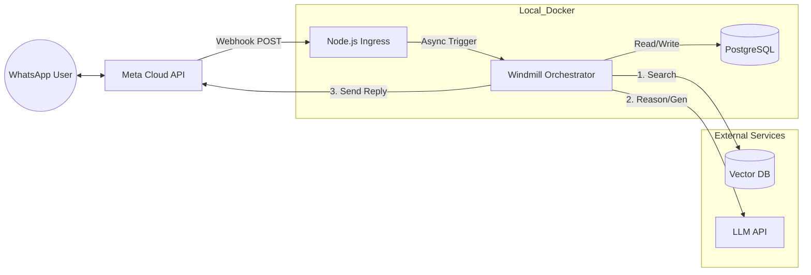

# FastBots Clone - MVP Architecture

## 1. Overview
A Multi-tenant WhatsApp Chatbot Platform (SaaS) inspired by FastBots.ai.
- **Tenants:** Businesses who upload data and configure bots.
- **Users:** End customers chatting via WhatsApp.
- **Goal:** Intelligent RAG-based answers + Agentic capabilities (Tool use).

## 2. Tech Stack
- **Ingress Layer:** Node.js (Express)
  - Handles high-concurrency Webhook traffic from Meta.
  - Verifies signatures and acknowledges requests immediately.
- **Orchestration:** Windmill
  - Manages the logic flow, state, and background processing.
  - Hosting: Self-hosted via Docker Compose.
- **Database:** PostgreSQL
  - Stores Tenant configs, User context, and Chat Logs.
- **Vector Store:** pgvector
  - Stores embeddings of uploaded PDFs/Text for RAG.
- **AI/LLM:** OpenAI (Gemini / OpenAI )
  - Handles reasoning, tool selection, and text generation.
- **Tunneling:** Ngrok
  - Exposes local Docker containers to the public internet during dev.

## 3. System Architecture Diagram

## 4. Data Flow (The "Agentic" Pipeline)

- **Ingestion:** Node.js receives POST /webhook, verifies X-Hub-Signature, pushes payload to Windmill, returns 200 OK.
- **Context Loading (Step 1):**
  - Windmill extracts `phone_number_id` (Chatbot ID) and `user_phone`.
  - DB Query: Fetch Tenant settings + Chat History + User Profile.
- **AI Reasoning (Step 2 - Python):**
  - Inputs: History, System Prompt, RAG Tools.
  - Loop:
    - LLM analyzes query.
    - Decision: Call `search_knowledge_base` (RAG)? Call `get_order` (MCP)? Or just Reply?
    - If Tool needed: Execute Tool → Feed result back to LLM → Generate Answer.
- **Response (Step 3):** Windmill sends final text to WhatsApp API.
- **Persistence (Step 4):** Save the interaction to `conversation_logs` and update `contacts` metadata.

## 5. Database Schema Strategy

- **Tenants Table:** Stores API keys and Bot configurations.
- **Contacts Table:** Stores end-user data (Composite Key: `phone` + `tenant_id`).
- **Logs Table:** History of all messages for context windowing.

