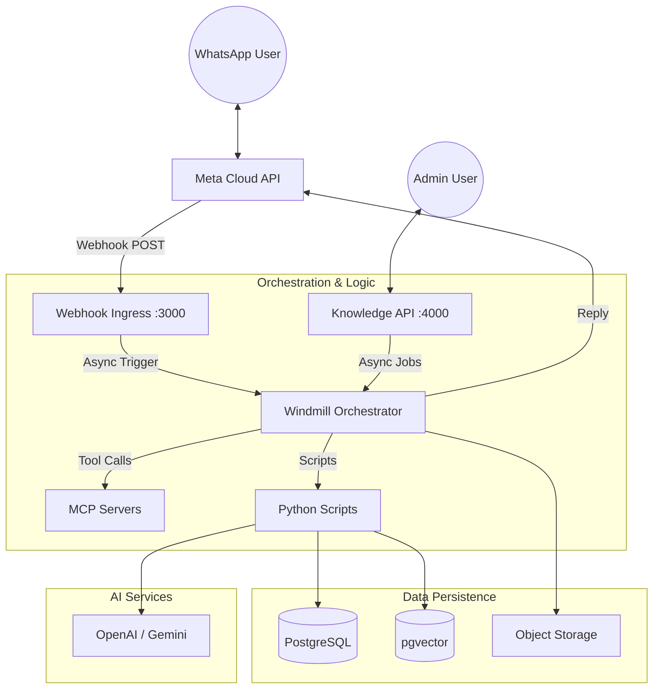

# WhatsApp Chatbot Platform (SaaS)

## Project Structure

```text
src/
├── docker-compose.yml              # Main services (Windmill, Postgres, APIs)
├── webhook-server/                 # Node.js WhatsApp webhook handler (Port 3000)
├── api-server/                     # Knowledge Base Management API (Port 4000)
├── mcp-servers/                    # Model Context Protocol Servers
│   ├── lead-capture/               # CRM integration tool (Port 3002)
│   ├── pricing-calculator/         # Pricing logic tool (Port 3001)
│   └── contact-owner/              # Notification tool
├── db/                             # Database schema and migrations
├── f/development/                  # Windmill scripts (Business Logic)
│   ├── 1_whatsapp_context_loading.py
│   ├── 2_whatsapp_llm_processing.py
│   ├── RAG_process_documents.py
│   └── ...
├── tests/                          # Test Suite
│   ├── integration/                # End-to-end flow tests
│   ├── live/                       # Real API tests (OpenAI/Gemini)
│   └── unit/                       # Logic verification
└── docs/                           # Documentation
```

## Quick Start

### Prerequisites

- Docker & Docker Compose
- PostgreSQL 16+ with pgvector extension
- OpenAI API key (for embeddings)
- Google Gemini API key (for LLM)
- WhatsApp Business Account

### 1. Environment Setup

```bash
cp .env.example .env
# Edit .env with your credentials
```

### 2. Start Services

```bash
docker-compose up -d

# Services:
# - Windmill: http://localhost:8081
# - Webhook Server: http://localhost:3000
# - Knowledge API: http://localhost:4000
# - MCP Servers: http://localhost:3001, http://localhost:3002
```

### 3. Initialize Database

```bash
# Full reset (Drop, Create, Seed)
./db/manage_db.sh reset
```

### 4. Configure Webhooks

Set your WhatsApp Webhook URL to: `https://your-domain.com/webhook`

## Key Features Implementation

### 1. Agent Loop with MCP Tools

Located in `f/development/2_whatsapp_llm_processing.py`.
The agent automatically discovers and calls tools defined in `mcp-servers/`.

**Available Tools:**

- **Pricing Calculator**: Calculates costs based on volume/tier (Port 3001).
- **Lead Capture**: Upserts contact info into the CRM table (Port 3002).
- **Contact Owner**: Notifies human agents.

### 2. RAG Knowledge Base API

A dedicated API (api-server) handles document ingestion.

**Endpoints:**

- `POST /api/chatbots/:id/knowledge/upload` (PDF/DOCX)
- `POST /api/chatbots/:id/knowledge/url` (Single URL)
- `POST /api/chatbots/:id/knowledge/crawl` (Web Crawler)

**Processing Pipeline:**
API Request → Windmill Job → Text Extraction → Chunking → OpenAI Embedding → pgvector Storage.

### 3. Usage Quota Enforcement

**Automatic Enforcement:**

- Real-time checking of Message and Token limits via `3_3_log_usage.py` and `middleware/quota.js`.
- Configurable per-tier limits (Free, Pro, Enterprise).
- Automatic rejection of messages when over quota.

## Testing

The project includes a comprehensive test suite in `tests/`.

```bash
# Run Unit & Integration tests
pytest tests/

# Run Live tests (Real LLM calls - Costs money!)
pytest tests/live/ -m live

# Run specific integration flow
pytest tests/integration/test_full_flow.py
```

## Monitoring

**Key Tables:**

- `system_alerts`: Critical failures and quota warnings.
- `usage_logs`: Granular billing data.
- `tool_executions`: Performance and success/failure rates of MCP tools.

## Roadmap

### Completed ✅

- Multi-tenant database schema with pgvector
- WhatsApp webhook ingress & signature verification
- 3-step Windmill processing flow
- Agent loop with MCP Tool support
- Knowledge Base API (Upload, Crawl, Ingest)
- Usage tracking and quota enforcement
- "Lead Capture" & "Pricing" MCP Servers
- Live & Integration Test Suite

### In Progress 🚧

- Dashboard UI (Frontend)
- Advanced RAG (Hybrid search with re-ranking)
- Google Docs integration

### Future 🔮

- WhatsApp media handling (images, voice notes)
- Visual flow builder
- Real-time WebSocket monitoring

---

# WhatsApp Chatbot Platform - Architecture

## 1. Overview

A Multi-tenant WhatsApp Chatbot Platform (SaaS) designed for scale and extensibility.

- **Tenants**: Businesses who upload data and configure bots.
- **Users**: End customers chatting via WhatsApp.
- **Goal**: Intelligent RAG-based answers + Agentic capabilities via standard protocols (MCP).

## 2. Tech Stack

### Core Services

- **Ingress Layer**: Node.js (Express)
  - Handles high-concurrency Webhook traffic from Meta.

- **Management Layer**: Node.js (Express)
  - api-server (Port 4000) for Knowledge Base management and RAG ingestion.

- **Orchestration**: Windmill
  - Manages the logic flow, state, and background processing (RAG jobs).

- **Tooling**: MCP Servers (Node.js)
  - Microservices exposing tools like Pricing Calculation and Lead Capture.

### Data & AI

- **Database**: PostgreSQL
  - Relational data: Tenants, Users, Logs.
  - Vector data: pgvector for embeddings (HNSW indexes).

- **AI/LLM**: Google Gemini / OpenAI
  - Handles reasoning, tool selection, and text generation.

## 3. System Architecture Diagram



## 4. Webhook Ingestion & Security Architecture

The system uses a Split-Layer Ingestion strategy to handle WhatsApp webhooks securely and efficiently.

### 4.1. Data Flow

1. Meta (WhatsApp) sends a POST request to our exposed endpoint.

2. **Node.js Gateway** (`webhook-server/`):
   - Acts as the public-facing entry point.
   - **Security**: Validates the X-Hub-Signature to ensure the request is genuinely from Meta.
   - **Rate Limiting**: Applies strict IP and payload-based rate limiting to prevent DoS attacks.
   - **Routing**: If the request is valid, it forwards the payload to the Windmill internal endpoint.

3. **Windmill Engine** (`f/development/whatsapp_webhook_processor__flow`):
   - Executes the business logic (Lead qualification, RAG retrieval, LLM generation).
   - Handles the long-running asynchronous orchestration.

### 4.2. Why this Split?

- **Security**: Keeps the Windmill instance private/internal; only the lightweight Node.js server is exposed to the public internet.
- **Resilience**: The Node.js server can quickly acknowledge Webhooks (returning 200 OK) to satisfy Meta's timeout requirements (~3s) before the heavy LLM processing begins in Windmill.

## 5. Data Flows

### A. The "Agentic" Conversation Flow

1. **Ingestion**: Node.js receives POST /webhook, verifies signature, pushes payload to Windmill.

2. **Context Loading (Step 1)**:
   - Windmill loads Tenant config, User Profile, and Chat History.
   - Checks Idempotency and Usage Quotas.

3. **AI Reasoning (Step 2)**:
   - Inputs: History, System Prompt, RAG Context, Available Tools.
   - **Loop**:
     - LLM decides to call a tool (e.g., `calculate_pricing`).
     - Windmill executes the tool via HTTP to the relevant MCP Server.
     - Result is fed back to LLM.

4. **Response (Step 3)**: Final text sent to WhatsApp API.

5. **Persistence**: Logs saved to `messages` and `usage_logs`.

### B. The Knowledge Ingestion Flow

1. **Upload**: Admin sends PDF/URL to Knowledge API (:4000).

2. **Job Creation**: API validates quota and triggers a Windmill background job.

3. **Processing**:
   - Windmill script `RAG_process_documents.py` runs.
   - Text extracted → Chunked → Embedded (OpenAI).

4. **Storage**: Embeddings stored in `document_chunks` table with HNSW index.

## 6. Database Schema Strategy

- **Tenants & Config**: `organizations`, `chatbots`, `org_integrations`.
- **RAG**: `knowledge_sources`, `document_chunks` (vector).
- **Metrics**: `usage_logs`, `usage_summary`, `tool_executions`.
- **Operational**: `webhook_events` (idempotency), `system_alerts`.

---

# Development Workflow

## Database Schema Changes

**CRITICAL**: Whenever you modify the database schema (`create.sql`, `seed.sql`), you MUST:

1. **Reset the database:**
   ```bash
   ./db/manage_db.sh reset
   ```

2. **Verify your changes:**
   - Check that all new tables/columns exist.
   - Verify triggers (especially usage and timestamp triggers).

## MCP Server Development

The platform uses the Model Context Protocol (MCP) for tools. MCP servers are located in `mcp-servers/`.

### Adding a new MCP Tool:

1. Create a new directory in `mcp-servers/`.
2. Implement the server (Express.js recommended).
3. Expose `GET /tools` to return tool definitions (JSON Schema).
4. Implement `POST /tools/:tool_name` for execution.
5. Register the tool in the database (table `org_integrations`) or via the setup script.
6. Add the service to `docker-compose.yml`.

## Windmill Script Changes

After creating or modifying scripts in `f/development/`:

1. **Generate metadata:**
   ```bash
   wmill script generate-metadata
   ```

2. **Sync:**
   ```bash
   wmill sync push
   ```

## Testing Workflow

### 1. Unit & Integration Tests

Run these frequently. They mock external services (LLM, WhatsApp) and test logic + database integrity.

```bash
pytest tests/unit
pytest tests/integration
```

### 2. Live Tests (Cost Warning ⚠️)

Tests in `tests/live/` make real API calls to OpenAI and Google Gemini.

- Requires `OPENAI_API_KEY` and `GOOGLE_API_KEY` in `.env`.
- Run only when necessary to verify API contracts.

```bash
pytest tests/live/ -m live
```

### 3. API & Webhook Testing

- **API Server**: `curl http://localhost:4000/health`
- **MCP Servers**: `curl http://localhost:3001/health`

## Git Workflow

### Branch Strategy

```text
master (production-ready)
  ├── feature/rag-knowledge-base (Backend API work)
  ├── feature/mcp-tools (Tool development)
  └── fix/issue-description
```

### Pre-Commit Checklist:

- Database reset and verified (`./db/manage_db.sh reset`)
- Windmill metadata generated
- Docker containers build successfully (including new MCP servers)
- `pytest tests/integration` passes
- No secrets in code (use Windmill variables)
